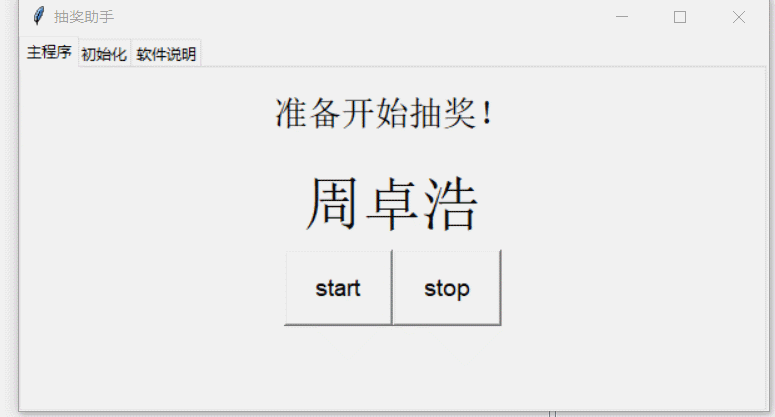

# Python-Lottery


Lottery 是我本人刚开始学 Python GUI 练手学习的小项目，是使用 tkinter 模块实现的。主要功能是用来实现自定义进行随机抽奖。


## 效果展示



其中，在初始化标签页内还能自定义对奖项与对应人数进行自定义设置。


### 下载

使用 clone

```
git clone https://github.com/RealIvyWong/Python-Lottery.git
```

或者直接 **Download ZIP** 获取所有文件

或者直接在 release 中下载。

### 文件说明

* **lottery.exe**：使用 pyinstaller 生成的可执行文件
* **lottery.py**：程序的 python 源代码
* **name.txt**：奖池名单，如果没有该文件，exe 和 py 文件运行都会直接退出
* **tubiao.ico**：嗯……只是一个图标文件

### 用法

* 首先，对奖池进行初始化，**修改 name.txt**，参与抽奖的每个名字一行，如示例文件中所示。如果有重名等情况，请记得加上标识文字。（注，如果 exe 文件和 name.txt 不在同一路径下，会报错找不到奖池而退出程序）

* 然后，打开 **lottery.exe** 文件。默认设置是【一等奖 1 名，二等奖 3 名，三等奖 5 名】。如需要修改奖项名与对应人数，则点击**初始化标签页**，清空默认设置后，自行进行新增。
* 在**主程序标签页**即可开始开始准备抽奖，每 start, stop 一次抽取一名获奖者。顺序是按初始化标签页中的表格，从上至下开始抽的。
* 全部抽取完后，再点 start, stop 会自动退出程序。
* 重新打开程序会重置回到默认设置（奖池不会改变）。

### 源码环境依赖

开发环境为 python 3.7.0，使用的是 tkinter 模块进行 GUI 开发。

没有使用除 tkinter 外，其他需要额外安装的第三方库。

### TODO

- [ ] 优化界面
- [ ] 加入快捷键

## 联系我

如果有什么建议或意见，欢迎联系我（huangyingjing@whu.edu.cn)或者提 issue！


## 参考

源码参考了以下网址提供的代码：

https://www.cnblogs.com/aloe-n/p/7059950.html


## 请我喝杯咖啡

如果我的代码帮助到了你，欢迎你请我喝杯咖啡~

 